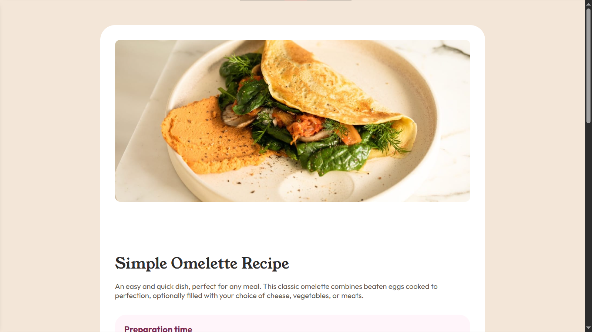

# Frontend Mentor - Recipe page solution

This is a solution to the [Recipe page challenge on Frontend Mentor](https://www.frontendmentor.io/challenges/recipe-page-KiTsR8QQKm). Frontend Mentor challenges help you improve your coding skills by building realistic projects. 

## Table of contents

- [Overview](#overview)
  - [The challenge](#the-challenge)
  - [Screenshot](#screenshot)
  - [Links](#links)
- [My process](#my-process)
  - [Built with](#built-with)
- [Author](#author)
- [Acknowledgments](#acknowledgments)

## Overview

### Screenshot

### Links

- Solution URL: (https://www.frontendmentor.io/learning-paths/getting-started-on-frontend-mentor-XJhRWRREZd/challenge/65e6f48617e502f0b6ca3d02/submit)
- Live Site URL: (https://blaze-x73.github.io/Frontendmentor-Recipe-Page/)

## My process
I started with the basic HTML structure and applied basic styling from top to bottom. I later put all contents of the card except the image in a section tag to allow for the image to occupy the full screen width once the width was equal to or below 572px using a media query.

### Built with

- Semantic HTML5 markup
- CSS custom properties
- Flexbox
- CSS Grid
- Mobile-first workflow 

## Author

- Frontend Mentor - [@yourusername](https://www.frontendmentor.io/profile/Blaze-X73)

## Acknowledgments
My Lord and Saviour Jesus Christ.
